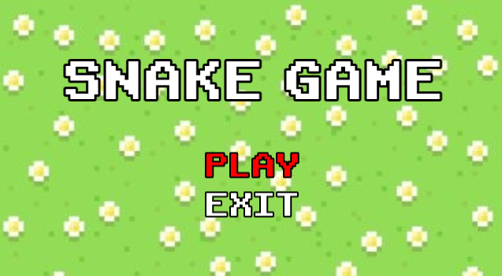
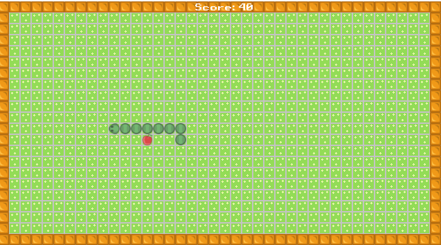
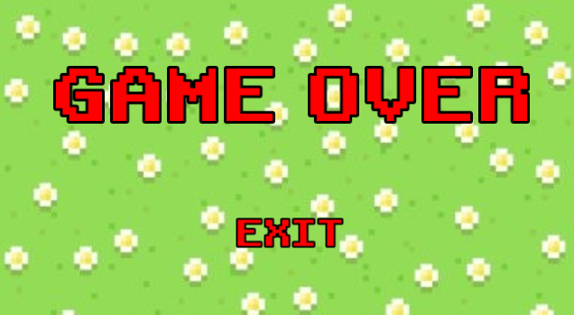

# SNAKE

Proyecto desarrollado sobre MinGW64 utilizando Msys2
y editor Visual Studio Code.

## Desarrolladores
#### Alan Dorantes Verdin #23110139 
#### Josue Gael Guzman Chavez #23110129

## Objetivo
El objetivo de este proyecto es hacer un juego, con ayuda de la libreria SFML utilizando graficos, basado en el juego arcade Snake, y así reforzar los conocimientos que se han aprendido a lo largo del curso de Programación Avanzada.

## Descripción
- El famoso juego "Snake" consiste en tomar el rol de una serpiente que se puede mover hacia delante, atrás, derecha e izquierda.

- Su objetivo es comer, cuantas más pueda, las distintas manzanas que aparecen de forma aleatoria en el mapa, y así crecer el tamaño de su cuerpo, evitando colisionar con las paredes que lo rodean y consigo mismo, si esto sucede el juego finaliza y mientras mayor sea su tamaño se obtendrá más puntuación.

## Ejecutable del juego
Instalar todas las dependencias necesarias y dentro de la terminal de vscode ejecutar:
> make runmain

## Controles
- Flecha Abajo = Down
- Flecha Arriba = Up
- Flecha Derecha = Rigth
- Flecha Izquierda = Left

## Carpetas
- bin/ - Contiene los ejecutables del proyecto
- src/ - Contiene el código fuente
- assets/ - Contiene los recursos del proyecto
- docs/ - Contiene la documentación del proyecto
- include/ - Son los archivos de cabecera

### Clases
- AssetCtrl
- Control
- GameOver
- GamePlay
- GameSnake
- MenuPr
- Snake
- State
- StateCtrl

## Librerias
- SFML
- DevTools

## Plugins VSCode
- Material Icon
- Plant UML
- GitGraph
- C/C++

## Imagenes dentro del juego

## Video dentro del juego

___